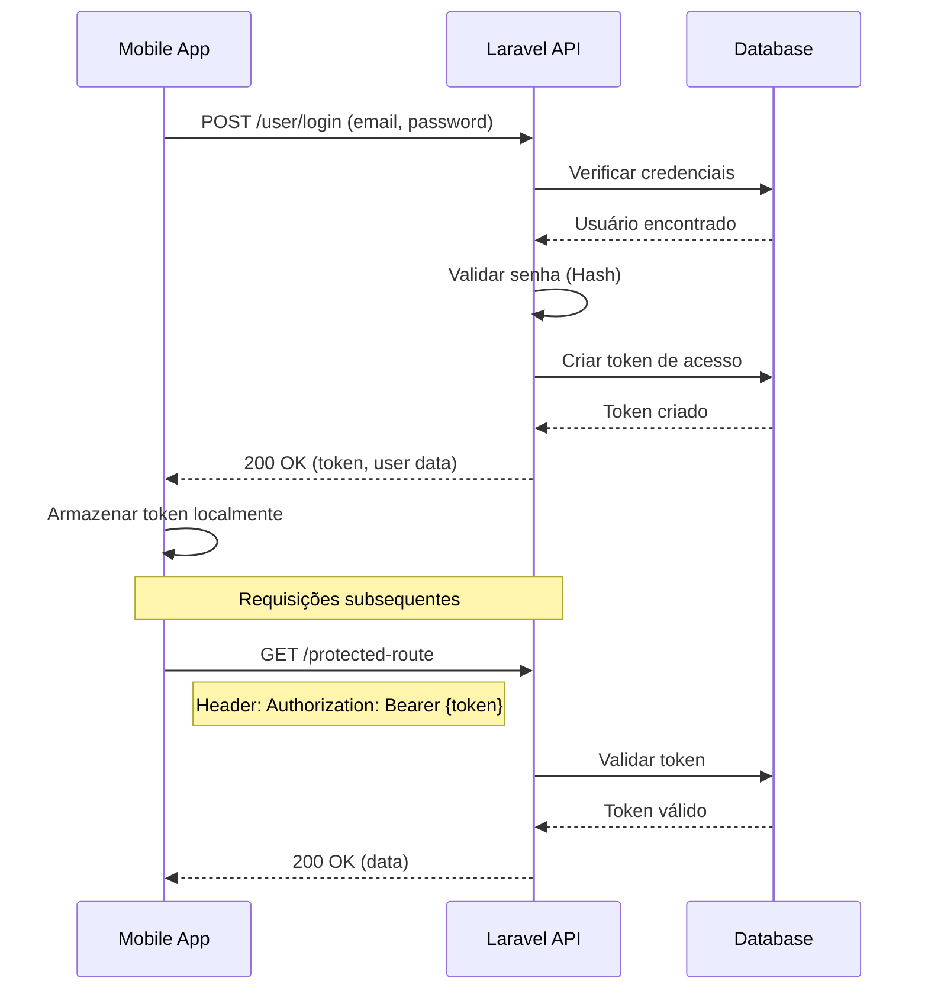
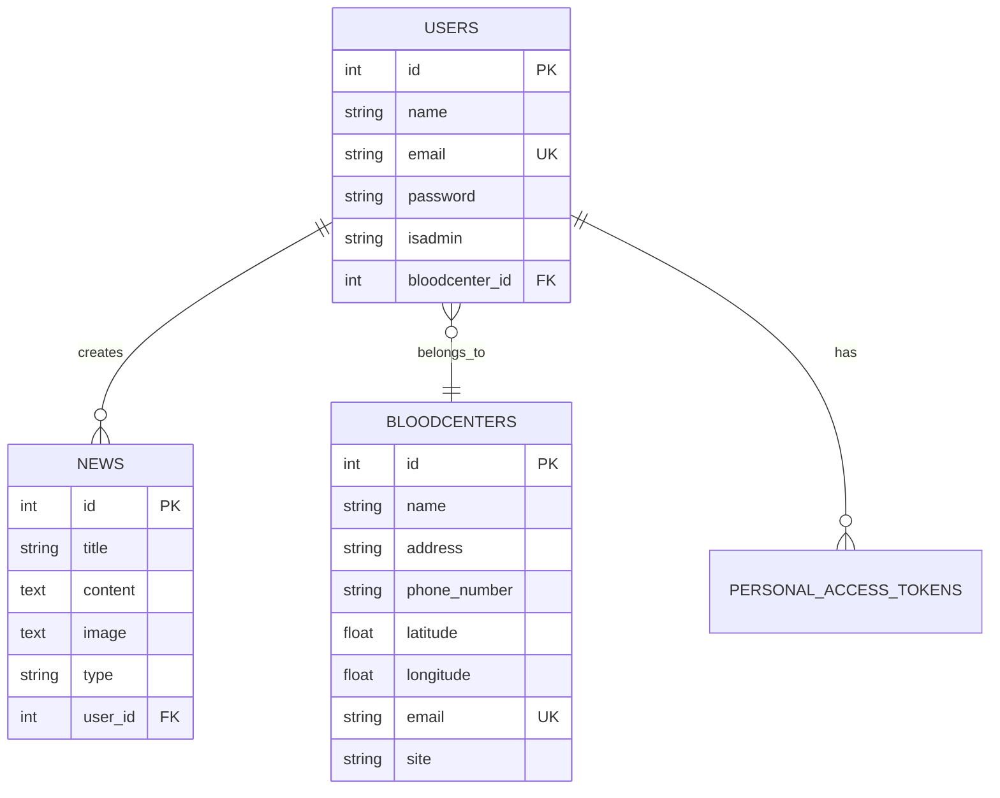

Vou fornecer uma explicação detalhada da base de código e gerar uma documentação completa em português.Baseando-me na documentação existente do projeto VitaLink, vou fornecer uma explicação detalhada e completa de todo o codebase em português:

# 📚 Documentação Completa do Sistema VitaLink

## 🎯 Visão Geral

O **VitaLink** é uma plataforma inovadora de gerenciamento de doação de sangue desenvolvida para conectar doadores a hemocentros em todo o Brasil. O sistema visa aumentar o número de doações através de tecnologia moderna e comunicação eficiente.

### Componentes Principais

1. **API Backend (Laravel)** - Sistema robusto de gerenciamento de dados
2. **Aplicativo Mobile (Flutter)** - Interface intuitiva para doadores

## 🏗️ Arquitetura Detalhada do Sistema

### Backend - API Laravel# Documentação Completa do Projeto VitaLink em Português

## 📋 Índice

1. [Visão Geral do Sistema](#visão-geral-do-sistema)
2. [Arquitetura do Sistema](#arquitetura-do-sistema)
3. [Backend - API Laravel](#backend---api-laravel)
4. [Frontend - Aplicativo Mobile Flutter](#frontend---aplicativo-mobile-flutter)
5. [Sistema de Autenticação](#sistema-de-autenticação)
6. [Sistema de Notificações](#sistema-de-notificações)
7. [Banco de Dados](#banco-de-dados)
8. [Guia de Instalação](#guia-de-instalação)
9. [Guia de Desenvolvimento](#guia-de-desenvolvimento)
10. [Testes e Qualidade](#testes-e-qualidade)
11. [Deploy e Produção](#deploy-e-produção)
12. [Solução de Problemas](#solução-de-problemas)

---

## 🩸 Visão Geral do Sistema

O **VitaLink** é uma plataforma integrada para gerenciamento de doação de sangue, desenvolvida para facilitar a conexão entre doadores de sangue e hemocentros no Brasil. O sistema foi projetado com o objetivo de aumentar o número de doações de sangue através de tecnologia moderna e acessível.

### Objetivos Principais

- **Conectar Doadores e Hemocentros**: Facilitar o encontro entre quem precisa doar e onde doar
- **Notificações de Emergência**: Sistema de alertas para situações críticas de estoque de sangue
- **Localização Inteligente**: Encontrar hemocentros próximos usando geolocalização
- **Campanhas de Conscientização**: Promover a cultura de doação através de conteúdo educativo
- **Gestão Eficiente**: Ferramentas administrativas para hemocentros gerenciarem campanhas

### Componentes do Sistema

1. **API Backend (Laravel 11)**
   - Servidor RESTful para gerenciamento de dados
   - Sistema de autenticação baseado em tokens
   - Integração com Firebase para notificações push
   - Banco de dados SQLite para desenvolvimento

2. **Aplicativo Mobile (Flutter)**
   - Interface intuitiva para doadores
   - Suporte para Android e iOS
   - Funcionalidades offline
   - Sistema de notificações em tempo real

---

## 🏗️ Arquitetura do Sistema

### Diagrama de Arquitetura

```
┌─────────────────┐     ┌─────────────────┐     ┌─────────────────┐
│                 │     │                 │     │                 │
│  App Mobile     │────▶│   API Laravel   │────▶│    Firebase     │
│   (Flutter)     │     │   (Backend)     │     │  (Notificações) │
│                 │     │                 │     │                 │
└─────────────────┘     └────────┬────────┘     └─────────────────┘
                                 │
                                 ▼
                        ┌─────────────────┐
                        │                 │
                        │  Banco SQLite   │
                        │   (Database)    │
                        │                 │
                        └─────────────────┘
```

### Estrutura de Diretórios

#### Backend (API)
```
vitalink/api/
├── app/                           # Código principal da aplicação
│   ├── Console/                   # Comandos Artisan customizados
│   ├── Exceptions/                # Tratamento de exceções
│   ├── Http/                      # Camada HTTP
│   │   ├── Controllers/           # Controladores da API
│   │   │   ├── AuthController.php # Autenticação (login/logout)
│   │   │   ├── BloodCenterController.php # CRUD de hemocentros
│   │   │   ├── NewsController.php # CRUD de notícias/campanhas
│   │   │   └── UserController.php # CRUD de usuários
│   │   ├── Middleware/            # Middlewares HTTP
│   │   └── Requests/              # Form Requests (validação)
│   ├── Models/                    # Modelos Eloquent ORM
│   │   ├── BloodCenter.php        # Modelo de hemocentros
│   │   ├── News.php               # Modelo de notícias
│   │   └── User.php               # Modelo de usuários
│   ├── Providers/                 # Service Providers
│   │   ├── AppServiceProvider.php
│   │   └── FirebaseServiceProvider.php # Configuração Firebase
│   └── Services/                  # Serviços de negócio
│       ├── FirebaseService.php    # Integração Firebase
│       └── PaginateAndFilter.php  # Paginação e filtros
├── bootstrap/                     # Bootstrap do framework
├── config/                        # Arquivos de configuração
│   ├── app.php                    # Configurações gerais
│   ├── auth.php                   # Configurações de autenticação
│   ├── cors.php                   # CORS para requisições cross-origin
│   ├── database.php               # Configurações de banco
│   └── sanctum.php                # Laravel Sanctum (tokens)
├── database/                      # Banco de dados
│   ├── factories/                 # Factories para testes
│   ├── migrations/                # Migrações do banco
│   └── seeders/                   # Seeders (dados iniciais)
├── public/                        # Diretório público
│   └── index.php                  # Ponto de entrada
├── resources/                     # Recursos (views, assets)
├── routes/                        # Definição de rotas
│   ├── api.php                    # Rotas da API
│   ├── auth.php                   # Rotas de autenticação
│   └── web.php                    # Rotas web (não utilizadas)
├── storage/                       # Armazenamento
│   ├── app/                       # Arquivos da aplicação
│   ├── framework/                 # Cache do framework
│   ├── keys/                      # Chaves de API
│   │   └── assis-ofertas-*.json   # Credenciais Firebase
│   └── logs/                      # Logs do sistema
├── tests/                         # Testes automatizados
├── .env                           # Variáveis de ambiente
├── composer.json                  # Dependências PHP
├── package.json                   # Dependências Node.js
└── phpunit.xml                    # Configuração de testes
```

#### Mobile (Flutter)
```
vitalink/mobile/
├── android/                       # Configurações Android
│   ├── app/                       # Aplicação Android
│   │   └── src/main/             
│   │       └── AndroidManifest.xml # Permissões e configurações
│   └── gradle/                    # Build Gradle
├── ios/                           # Configurações iOS
│   ├── Runner/                    # Aplicação iOS
│   │   └── Info.plist            # Permissões e configurações
│   └── Podfile                    # Dependências iOS
├── lib/                           # Código-fonte Dart
│   ├── services/                  # Camada de serviços
│   │   ├── helpers/               # Classes auxiliares
│   │   │   └── database_helper.dart # SQLite local
│   │   ├── models/                # Modelos de dados
│   │   │   ├── blood_center_model.dart
│   │   │   ├── nearby_model.dart
│   │   │   ├── news_model.dart
│   │   │   ├── page_model.dart
│   │   │   └── user_model.dart
│   │   ├── repositories/          # Repositórios (acesso a dados)
│   │   │   ├── api/              # Repositórios API
│   │   │   └── user_repository.dart
│   │   └── stores/                # Gerenciamento de estado
│   │       ├── blood_center_store.dart
│   │       ├── nearby_store.dart
│   │       ├── news_store.dart
│   │       └── user_store.dart
│   ├── src/                       # Interface do usuário
│   │   ├── app.dart              # Widget principal do app
│   │   ├── components/            # Componentes reutilizáveis
│   │   │   ├── blood_bank_card.dart
│   │   │   ├── news_card.dart
│   │   │   └── empty_state.dart
│   │   ├── localization/          # Internacionalização
│   │   ├── pages/                 # Telas do aplicativo
│   │   │   ├── blood_centers.dart # Lista de hemocentros
│   │   │   ├── guide.dart        # Guia de doação
│   │   │   ├── history.dart      # Histórico de doações
│   │   │   ├── home.dart         # Tela inicial
│   │   │   ├── introduction_screen.dart # Tutorial
│   │   │   ├── news.dart         # Notícias e campanhas
│   │   │   └── profile.dart      # Perfil do usuário
│   │   └── settings/              # Configurações
│   ├── main.dart                  # Ponto de entrada
│   └── styles.dart                # Estilos globais
├── assets/                        # Recursos estáticos
│   ├── images/                    # Imagens do app
│   └── fonts/                     # Fontes tipográficas
│       └── inter/                 # Fonte Inter
├── test/                          # Testes unitários
├── pubspec.yaml                   # Dependências e configurações
└── README.md                      # Documentação básica
```

---

## 🔧 Backend - API Laravel

### Controladores (Controllers)

#### AuthController
**Localização**: `api/app/Http/Controllers/AuthController.php`

Gerencia autenticação de usuários no sistema.

```php
class AuthController extends Controller
{
    /**
     * Realiza login do usuário
     * @param Request $request - Deve conter email e password
     * @return JsonResponse - Token de acesso ou erro
     */
    public function store(Request $request)
    {
        // Validação de credenciais
        $user = User::where('email', $request->email)->first();

        if (!$user || !Hash::check($request->password, $user->password)) {
            return response()->json(
                ['message' => 'Invalid credentials'],
                Response::HTTP_UNPROCESSABLE_ENTITY
            );
        }

        // Gera token de acesso
        return response()->json([
            'message' => 'Login successful',
            'token' => $user->createToken($request->email)->plainTextToken,
            'user' => $user,
        ], Response::HTTP_OK);
    }

    /**
     * Realiza logout do usuário
     * @param Request $request - Deve conter token válido
     * @return JsonResponse - Confirmação de logout
     */
    public function destroy(Request $request)
    {
        // Revoga token atual
        $request->user()->currentAccessToken()->delete();

        return response()->json([
            'message' => 'Logout successful',
        ], Response::HTTP_OK);
    }
}
```

#### BloodCenterController
**Localização**: `api/app/Http/Controllers/BloodCenterController.php`

Gerencia operações CRUD de hemocentros.

**Métodos principais**:
- `index()` - Lista hemocentros com paginação e filtros
- `store()` - Cria novo hemocentro (requer superadmin)
- `show()` - Exibe detalhes de um hemocentro
- `update()` - Atualiza dados do hemocentro
- `destroy()` - Remove hemocentro e dados relacionados

#### NewsController
**Localização**: `api/app/Http/Controllers/NewsController.php`

Gerencia notícias e campanhas de doação.

**Funcionalidades especiais**:
- Integração com Firebase para notificações push
- Tipos de notícia: `campaign` (campanha) e `emergency` (emergência)
- Notificações segmentadas por tipo sanguíneo

### Modelos (Models)

#### User Model
```php
class User extends Authenticatable
{
    use HasFactory, Notifiable, HasApiTokens;

    protected $fillable = [
        'name',           // Nome completo
        'email',          // Email único
        'password',       // Senha criptografada
        'bloodcenter_id', // FK para hemocentro
        'isadmin',        // Tipo: superadmin/admin/null
    ];

    protected $hidden = [
        'password',
        'remember_token',
    ];

    // Relacionamentos
    public function bloodCenter() {
        return $this->belongsTo(BloodCenter::class);
    }

    public function news() {
        return $this->hasMany(News::class);
    }
}
```

#### BloodCenter Model
```php
class BloodCenter extends Model
{
    use HasFactory;
    
    protected $table = 'bloodcenters';
    
    protected $fillable = [
        'name',         // Nome do hemocentro
        'email',        // Email de contato
        'latitude',     // Coordenada latitude
        'longitude',    // Coordenada longitude
        'address',      // Endereço completo
        'phone_number', // Telefone
        'site',         // Website
    ];

    // Relacionamentos
    public function users() {
        return $this->hasMany(User::class);
    }
}
```

#### News Model
```php
class News extends Model
{
    use HasFactory;

    protected $fillable = [
        'title',    // Título da notícia
        'content',  // Conteúdo completo
        'image',    // Imagem em base64
        'user_id',  // FK para usuário criador
        'type',     // Tipo: campaign/emergency
    ];

    // Relacionamentos
    public function user() {
        return $this->belongsTo(User::class);
    }
}
```

### Serviços (Services)

#### FirebaseService
**Localização**: `api/app/Services/FirebaseService.php`

Gerencia envio de notificações push via Firebase Cloud Messaging.

```php
class FirebaseService
{
    protected $messaging;

    public function __construct(Messaging $messaging)
    {
        $this->messaging = $messaging;
    }
    
    /**
     * Envia notificação para tópico específico
     * @param string $title - Título da notificação
     * @param string $content - Conteúdo da notificação
     * @param string $bloodType - Tipo sanguíneo (tópico)
     * @param string $type - Tipo de notificação
     */
    public function sendNotification($title, $content, $bloodType, $type)
    {
        try {
            $message = CloudMessage::withTarget('topic', $bloodType)
                ->withNotification(Notification::create($title, $content))
                ->withData(['key' => $type]);
            
            $result = $this->messaging->send($message);
            Log::info('Firebase notification sent successfully', ['result' => $result]);
            return $result;
            
        } catch (\Exception $e) {
            Log::error('Firebase notification error: ' . $e->getMessage());
            throw $e;
        }
    }
}
```

#### PaginateAndFilter Service
**Localização**: `api/app/Services/PaginateAndFilter.php`

Fornece funcionalidades de paginação e filtragem para listagens.

### Rotas da API

**Arquivo**: `api/routes/api.php`

#### Rotas de Autenticação
```php
// Públicas
POST   /user/login      # Login de usuário
POST   /user/register   # Cadastro de usuário

// Protegidas (requer autenticação)
DELETE /user/logout     # Logout
GET    /user           # Dados do usuário autenticado
```

#### Rotas de Usuários
```php
// Protegidas
GET    /user           # Listar todos usuários
PUT    /user/{id}      # Atualizar usuário
DELETE /user/{id}      # Remover usuário
```

#### Rotas de Hemocentros
```php
// Protegidas
GET    /blood-center           # Listar hemocentros
POST   /blood-center/register  # Criar hemocentro
GET    /blood-center/{id}      # Detalhes do hemocentro
PUT    /blood-center/{id}      # Atualizar hemocentro
DELETE /blood-center/{id}      # Remover hemocentro
```

#### Rotas de Notícias
```php
// Públicas
GET    /news           # Listar notícias

// Protegidas
POST   /news/register  # Criar notícia
GET    /news/{id}      # Detalhes da notícia
PUT    /news/{id}      # Atualizar notícia
DELETE /news/{id}      # Remover notícia
```

---

## 📱 Frontend - Aplicativo Mobile Flutter

### Arquitetura do Aplicativo

O aplicativo mobile utiliza uma arquitetura em camadas:

1. **Camada de Apresentação** (UI)
   - Páginas e componentes visuais
   - Widgets reutilizáveis
   - Temas e estilos

2. **Camada de Estado** (State Management)
   - Provider para gerenciamento de estado
   - Stores para cada domínio de dados
   - Notificação reativa de mudanças

3. **Camada de Dados** (Data Layer)
   - Repositórios para acesso a dados
   - Modelos de dados tipados
   - Integração com API e banco local

### Telas Principais

#### Home (Tela Inicial)
**Arquivo**: `mobile/lib/src/pages/home.dart`

- Dashboard com informações resumidas
- Acesso rápido às funcionalidades principais
- Status de doações e campanhas ativas

#### Blood Centers (Hemocentros)
**Arquivo**: `mobile/lib/src/pages/blood_centers.dart`

- Lista de hemocentros disponíveis
- Filtros por localização e nome
- Integração com GPS para distância
- Detalhes de contato e horários

#### News (Notícias e Campanhas)
**Arquivo**: `mobile/lib/src/pages/news.dart`

- Feed de notícias e campanhas
- Filtros por tipo (campanha/emergência)
- Visualização detalhada
- Compartilhamento social

#### Profile (Perfil do Usuário)
**Arquivo**: `mobile/lib/src/pages/profile.dart`

- Dados pessoais do doador
- Tipo sanguíneo e restrições
- Histórico de doações
- Configurações de notificações

#### Guide (Guia de Doação)
**Arquivo**: `mobile/lib/src/pages/guide.dart`

- Informações educativas sobre doação
- Requisitos e impedimentos
- Processo de doação passo a passo
- FAQ (Perguntas frequentes)

### Gerenciamento de Estado

O aplicativo utiliza o padrão **Provider** para gerenciamento de estado:

#### UserStore
```dart
class UserStore extends ChangeNotifier {
  final UserRepository repository;
  ValueNotifier<List<UserModel>> state = ValueNotifier([]);
  
  UserStore({required this.repository});
  
  // Métodos para manipulação de usuário
  Future<void> updateUser(UserModel user) async {
    await repository.updateUser(user);
    state.value = [user];
    notifyListeners();
  }
}
```

#### BloodCenterStore
```dart
class BloodCenterStore extends ChangeNotifier {
  final BloodRepository repository;
  List<BloodCenterModel> bloodCenters = [];
  
  // Busca hemocentros da API
  Future<void> fetchBloodCenters() async {
    bloodCenters = await repository.getBloodCenters();
    notifyListeners();
  }
}
```

#### NearbyStore
```dart
class NearbyStore extends ChangeNotifier {
  Position? currentPosition;
  List<NearbyModel> nearbyPlaces = [];
  
  // Calcula distância entre pontos
  double calculateDistance(double lat, double lon) {
    // Implementação usando Geolocator
  }
}
```

### Modelos de Dados

#### UserModel
```dart
class UserModel {
  final int id;
  final String name;
  final String birthDate;
  final String bloodType;
  final bool hasTattoo;
  final bool hasPermanentMakeup;
  final bool hasMicropigmentation;
  final bool viewedTutorial;
  
  // Construtores e métodos
}
```

#### BloodCenterModel
```dart
class BloodCenterModel {
  final int id;
  final String name;
  final String address;
  final String phoneNumber;
  final double latitude;
  final double longitude;
  final String? email;
  final String? site;
  
  // Construtores e métodos
}
```

#### NewsModel
```dart
class NewsModel {
  final int id;
  final String title;
  final String content;
  final String? image;
  final String type;
  final DateTime createdAt;
  
  // Construtores e métodos
}
```

### Persistência Local

O aplicativo utiliza **SQLite** para armazenamento local:

```dart
class DatabaseHelper {
  static final DatabaseHelper instance = DatabaseHelper._();
  static Database? _database;
  
  Future<Database> get database async {
    _database ??= await _initDatabase();
    return _database!;
  }
  
  Future<Database> _initDatabase() async {
    String path = join(await getDatabasesPath(), 'vitalink.db');
    return await openDatabase(
      path,
      version: 1,
      onCreate: _onCreate,
    );
  }
  
  Future<void> _onCreate(Database db, int version) async {
    // Criação das tabelas
    await db.execute('''
      CREATE TABLE users (
        id INTEGER PRIMARY KEY,
        name TEXT,
        birthDate TEXT,
        bloodType TEXT,
        ...
      )
    ''');
  }
}
```

### Integração com API

#### Configuração Base
```dart
class ApiConfig {
  static const String baseUrl = 'http://127.0.0.1:8000/api';
  static const Duration timeout = Duration(seconds: 30);
}
```

#### Exemplo de Repositório
```dart
class BloodRepository {
  final http.Client client = http.Client();
  
  Future<List<BloodCenterModel>> getBloodCenters() async {
    try {
      final response = await client.get(
        Uri.parse('${ApiConfig.baseUrl}/blood-center'),
        headers: {
          'Authorization': 'Bearer $token',
          'Accept': 'application/json',
        },
      ).timeout(ApiConfig.timeout);
      
      if (response.statusCode == 200) {
        final data = json.decode(response.body);
        return (data['data'] as List)
            .map((e) => BloodCenterModel.fromJson(e))
            .toList();
      } else {
        throw Exception('Failed to load blood centers');
      }
    } catch (e) {
      throw Exception('Network error: $e');
    }
  }
}
```

---

## 🔐 Sistema de Autenticação

### Laravel Sanctum

O sistema utiliza **Laravel Sanctum** para autenticação baseada em tokens:

#### Configuração
**Arquivo**: `api/config/sanctum.php`

```php
return [
    'stateful' => explode(',', env('SANCTUM_STATEFUL_DOMAINS')),
    'guard' => ['web'],
    'expiration' => null, // Tokens não expiram
    'token_prefix' => env('SANCTUM_TOKEN_PREFIX', ''),
];
```

#### Middleware de Proteção
```php
// Em routes/api.php
Route::middleware(['auth:sanctum'])->group(function () {
    // Rotas protegidas aqui
});
```

### Fluxo de Autenticação



### Segurança

#### Hashing de Senhas
```php
// Automático no Laravel usando bcrypt
'password' => Hash::make($request->password)
```

#### Validação de Tokens
```php
// Middleware auth:sanctum valida automaticamente
$user = $request->user(); // Usuário autenticado
```

#### Revogação de Tokens
```php
// Logout - revoga token atual
$request->user()->currentAccessToken()->delete();

// Revogar todos os tokens do usuário
$user->tokens()->delete();
```

---

## 🔔 Sistema de Notificações

### Firebase Cloud Messaging (FCM)

#### Configuração do Firebase
**Arquivo**: `api/app/Providers/FirebaseServiceProvider.php`

```php
public function register(): void
{
    $this->app->singleton(Messaging::class, function ($app) {
        // Define certificados SSL
        putenv('CURL_CA_BUNDLE=' . base_path('cacert.pem'));
        putenv('SSL_CERT_FILE=' . base_path('cacert.pem'));
        
        // Inicializa Firebase
        $firebase = (new Factory)
            ->withServiceAccount(base_path(env('FIREBASE_CREDENTIALS')));
            
        return $firebase->createMessaging();
    });
}
```

#### Credenciais Firebase
**Localização**: `api/storage/keys/firebase_credentials.json`

Arquivo JSON com credenciais do service account do Firebase.

### Tipos de Notificação

#### 1. Campanhas Gerais
- Enviadas para todos os usuários
- Informações sobre campanhas de doação
- Conscientização e educação

#### 2. Emergências por Tipo Sanguíneo
- Notificações segmentadas
- Urgência em estoque baixo
- Direcionadas por tipo sanguíneo

### Tópicos de Notificação

Os usuários são inscritos em tópicos baseados em seu tipo sanguíneo:

```
positiveA  - Tipo A+
negativeA  - Tipo A-
positiveB  - Tipo B+
negativeB  - Tipo B-
positiveAB - Tipo AB+
negativeAB - Tipo AB-
positiveO  - Tipo O+
negativeO  - Tipo O-
```

### Implementação no Mobile

#### Configuração Firebase
```dart
// Em main.dart ou configuração inicial
import 'package:firebase_messaging/firebase_messaging.dart';

Future<void> setupFirebase() async {
  await Firebase.initializeApp();
  
  // Solicitar permissão
  FirebaseMessaging messaging = FirebaseMessaging.instance;
  NotificationSettings settings = await messaging.requestPermission(
    alert: true,
    badge: true,
    sound: true,
  );
  
  // Inscrever em tópico baseado no tipo sanguíneo
  String bloodType = user.bloodType.replaceAll('+', 'positive')
                                   .replaceAll('-', 'negative');
  await messaging.subscribeToTopic(bloodType);
}
```

#### Recebimento de Notificações
```dart
// Handler para notificações em foreground
FirebaseMessaging.onMessage.listen((RemoteMessage message) {
  print('Notificação recebida: ${message.notification?.title}');
  // Exibir notificação local
});

// Handler para clique em notificação
FirebaseMessaging.onMessageOpenedApp.listen((RemoteMessage message) {
  // Navegar para tela específica
});
```

---

## 🗄️ Banco de Dados

### Estrutura do Banco SQLite

#### Migrações

**1. Tabela de Usuários**
```sql
CREATE TABLE users (
    id INTEGER PRIMARY KEY AUTOINCREMENT,
    name VARCHAR(255) NOT NULL,
    email VARCHAR(255) UNIQUE NOT NULL,
    password VARCHAR(255) NOT NULL,
    isadmin VARCHAR(255),
    bloodcenter_id INTEGER,
    email_verified_at TIMESTAMP,
    remember_token VARCHAR(100),
    created_at TIMESTAMP DEFAULT CURRENT_TIMESTAMP,
    updated_at TIMESTAMP DEFAULT CURRENT_TIMESTAMP,
    FOREIGN KEY (bloodcenter_id) REFERENCES bloodcenters(id)
);
```

**2. Tabela de Hemocentros**
```sql
CREATE TABLE bloodcenters (
    id INTEGER PRIMARY KEY AUTOINCREMENT,
    name VARCHAR(255) NOT NULL,
    address TEXT NOT NULL,
    phone_number VARCHAR(255) NOT NULL,
    latitude DECIMAL(10,8) NOT NULL,
    longitude DECIMAL(11,8) NOT NULL,
    email VARCHAR(255) UNIQUE,
    site VARCHAR(255),
    created_at TIMESTAMP DEFAULT CURRENT_TIMESTAMP,
    updated_at TIMESTAMP DEFAULT CURRENT_TIMESTAMP
);
```

**3. Tabela de Notícias**
```sql
CREATE TABLE news (
    id INTEGER PRIMARY KEY AUTOINCREMENT,
    title VARCHAR(255) NOT NULL,
    content TEXT NOT NULL,
    image TEXT,
    type VARCHAR(255) NOT NULL CHECK(type IN ('campaign', 'emergency')),
    user_id INTEGER NOT NULL,
    created_at TIMESTAMP DEFAULT CURRENT_TIMESTAMP,
    updated_at TIMESTAMP DEFAULT CURRENT_TIMESTAMP,
    FOREIGN KEY (user_id) REFERENCES users(id)
);
```

**4. Tabela de Tokens (Sanctum)**
```sql
CREATE TABLE personal_access_tokens (
    id INTEGER PRIMARY KEY AUTOINCREMENT,
    tokenable_type VARCHAR(255) NOT NULL,
    tokenable_id INTEGER NOT NULL,
    name VARCHAR(255) NOT NULL,
    token VARCHAR(64) UNIQUE NOT NULL,
    abilities TEXT,
    last_used_at TIMESTAMP,
    expires_at TIMESTAMP,
    created_at TIMESTAMP DEFAULT CURRENT_TIMESTAMP,
    updated_at TIMESTAMP DEFAULT CURRENT_TIMESTAMP
);
```

### Relacionamentos



### Seeders

#### DatabaseSeeder
```php
public function run(): void
{
    // Criar hemocentro padrão
    $bloodCenter = BloodCenter::create([
        'name' => 'Hemocentro Central',
        'address' => 'Rua Principal, 123',
        'latitude' => -23.550520,
        'longitude' => -46.633308,
        'phone_number' => '(11) 1234-5678',
        'email' => 'contato@hemocentro.com',
        'site' => 'www.hemocentro.com'
    ]);
    
    // Criar superadmin
    User::create([
        'name' => 'Administrador',
        'email' => 'admin@vitalink.com',
        'password' => Hash::make('password'),
        'isadmin' => 'superadmin',
        'bloodcenter_id' => $bloodCenter->id
    ]);
}
```

---

## 🚀 Guia de Instalação

### Requisitos do Sistema

#### Backend (Laravel)
- PHP >= 8.2
- Composer >= 2.0
- SQLite ou MySQL
- Extensões PHP: BCMath, Ctype, JSON, Mbstring, OpenSSL, PDO, Tokenizer, XML

#### Mobile (Flutter)
- Flutter SDK >= 3.0
- Dart SDK >= 3.0
- Android Studio ou Xcode
- Dispositivo físico ou emulador

### Instalação do Backend

#### 1. Clonar o Repositório
```bash
git clone https://github.com/seu-usuario/vitalink.git
cd vitalink/api
```

#### 2. Instalar Dependências
```bash
composer install
npm install
```

#### 3. Configurar Ambiente
```bash
cp .env.example .env
php artisan key:generate
```

#### 4. Configurar Banco de Dados
```bash
# Criar arquivo SQLite
touch database/database.sqlite

# Executar migrações
php artisan migrate

# Popular banco com dados iniciais
php artisan db:seed
```

#### 5. Configurar Firebase
1. Obter arquivo de credenciais do Firebase Console
2. Salvar em `storage/keys/` com nome configurado no `.env`
3. Baixar certificado CA: https://curl.se/ca/cacert.pem
4. Salvar como `cacert.pem` na raiz do projeto

#### 6. Iniciar Servidor
```bash
# Usar servidor PHP built-in (necessário para Firebase)
php -S 127.0.0.1:8000 -t public
```

### Instalação do Mobile

#### 1. Navegar para Diretório
```bash
cd ../mobile
```

#### 2. Instalar Dependências
```bash
flutter pub get
```

#### 3. Configurar Plataformas

**Android**:
- Abrir `android/app/src/main/AndroidManifest.xml`
- Verificar permissões necessárias
- Configurar google-services.json do Firebase

**iOS**:
- Abrir `ios/Runner/Info.plist`
- Adicionar descrições de permissões
- Configurar GoogleService-Info.plist do Firebase

#### 4. Executar Aplicativo
```bash
# Verificar dispositivos disponíveis
flutter devices

# Executar em modo debug
flutter run

# Executar em dispositivo específico
flutter run -d device_id
```

### Variáveis de Ambiente

#### Backend (.env)
```env
# Aplicação
APP_NAME=VitaLink
APP_ENV=local
APP_KEY=base64:...
APP_DEBUG=true
APP_TIMEZONE=America/Sao_Paulo
APP_URL=http://127.0.0.1:8000

# URLs
FRONTEND_URL=http://172.16.0.21:8080
ASSET_URL=http://127.0.0.1:8000

# Banco de Dados
DB_CONNECTION=sqlite
DB_DATABASE=database/database.sqlite

# Firebase
FIREBASE_CREDENTIALS=storage/keys/firebase_credentials.json

# Email (para desenvolvimento)
MAIL_MAILER=log
MAIL_FROM_ADDRESS="hello@vitalink.com"
MAIL_FROM_NAME="${APP_NAME}"

# Sessão
SESSION_DRIVER=file
SESSION_LIFETIME=120
SESSION_ENCRYPT=false
SESSION_PATH=/
SESSION_DOMAIN=null
```

#### Mobile (Configurações)
```dart
// Em api_config.dart ou similar
class ApiConfig {
  static const String baseUrl = 'http://127.0.0.1:8000/api';
  // Para dispositivo físico Android
  // static const String baseUrl = 'http://10.0.2.2:8000/api';
  // Para produção
  // static const String baseUrl = 'https://api.vitalink.com/api';
}
```

---

## 💻 Guia de Desenvolvimento

### Estrutura de Código

#### Padrões de Código - Backend

**PSR-12** para PHP:
```php
<?php

declare(strict_types=1);

namespace App\Http\Controllers;

use App\Models\User;
use Illuminate\Http\JsonResponse;
use Illuminate\Http\Request;
use Illuminate\Http\Response;

class UserController extends Controller
{
    /**
     * Display a listing of users.
     */
    public function index(Request $request): JsonResponse
    {
        $users = User::paginate(10);
        
        return response()->json([
            'data' => $users,
            'message' => 'Users retrieved successfully'
        ], Response::HTTP_OK);
    }
}
```

#### Padrões de Código - Mobile

**Dart Style Guide**:
```dart
import 'package:flutter/material.dart';
import 'package:provider/provider.dart';

/// Widget principal para exibir lista de hemocentros
class BloodCentersPage extends StatefulWidget {
  const BloodCentersPage({super.key});

  @override
  State<BloodCentersPage> createState() => _BloodCentersPageState();
}

class _BloodCentersPageState extends State<BloodCentersPage> {
  @override
  void initState() {
    super.initState();
    // Inicializar dados
    WidgetsBinding.instance.addPostFrameCallback((_) {
      _loadBloodCenters();
    });
  }
  
  Future<void> _loadBloodCenters() async {
    final store = context.read<BloodCenterStore>();
    await store.fetchBloodCenters();
  }
  
  @override
  Widget build(BuildContext context) {
    return Scaffold(
      appBar: AppBar(
        title: const Text('Hemocentros'),
      ),
      body: Consumer<BloodCenterStore>(
        builder: (context, store, child) {
          if (store.isLoading) {
            return const Center(
              child: CircularProgressIndicator(),
            );
          }
          
          return ListView.builder(
            itemCount: store.bloodCenters.length,
            itemBuilder: (context, index) {
              final center = store.bloodCenters[index];
              return BloodCenterCard(bloodCenter: center);
            },
          );
        },
      ),
    );
  }
}
```

### Comandos Úteis

#### Backend (Laravel)
```bash
# Limpar caches
php artisan cache:clear
php artisan config:clear
php artisan route:clear
php artisan view:clear

# Otimizar para produção
php artisan config:cache
php artisan route:cache
php artisan optimize

# Gerar recursos
php artisan make:controller NomeController --api
php artisan make:model NomeModel -m
php artisan make:request NomeRequest
php artisan make:seeder NomeSeeder

# Banco de dados
php artisan migrate:fresh --seed
php artisan migrate:rollback
php artisan migrate:status

# Testes
php artisan test
php artisan test --filter=NomeDoTeste

# Logs e debugging
php artisan tinker
tail -f storage/logs/laravel.log
```

#### Mobile (Flutter)
```bash
# Limpar e reconstruir
flutter clean
flutter pub get
flutter pub upgrade

# Análise de código
flutter analyze
flutter format .

# Testes
flutter test
flutter test --coverage

# Build
flutter build apk --release
flutter build appbundle --release
flutter build ios --release

# Debugging
flutter doctor -v
flutter logs
flutter inspector

# Gerar assets
flutter pub run flutter_launcher_icons:main
flutter pub run flutter_native_splash:create
```

### Debugging

#### Backend - Laravel Telescope
```bash
composer require laravel/telescope --dev
php artisan telescope:install
php artisan migrate
```

Acesse: `http://127.0.0.1:8000/telescope`

#### Mobile - Flutter DevTools
```bash
flutter pub global activate devtools
flutter pub global run devtools
```

### Git Workflow

#### Branches
```bash
main        # Produção
develop     # Desenvolvimento
feature/*   # Novas funcionalidades
hotfix/*    # Correções urgentes
release/*   # Preparação para release
```

#### Commits Semânticos
```bash
feat: Adiciona nova funcionalidade
fix: Corrige bug
docs: Atualiza documentação
style: Formatação de código
refactor: Refatoração sem mudança de funcionalidade
test: Adiciona ou modifica testes
chore: Tarefas de manutenção
```

---

## 🧪 Testes e Qualidade

### Testes Backend (PHPUnit/Pest)

#### Estrutura de Testes
```
api/tests/
├── Feature/           # Testes de integração
│   ├── Auth/         # Testes de autenticação
│   ├── BloodCenter/  # Testes de hemocentros
│   └── News/         # Testes de notícias
├── Unit/             # Testes unitários
└── TestCase.php      # Classe base
```

#### Exemplo de Teste
```php
<?php

namespace Tests\Feature\Auth;

use App\Models\User;
use Illuminate\Foundation\Testing\RefreshDatabase;
use Tests\TestCase;

class AuthenticationTest extends TestCase
{
    use RefreshDatabase;
    
    public function test_users_can_authenticate_using_the_login_endpoint(): void
    {
        $user = User::factory()->create();
        
        $response = $this->postJson('/api/user/login', [
            'email' => $user->email,
            'password' => 'password',
        ]);
        
        $response->assertOk()
                 ->assertJsonStructure([
                     'message',
                     'token',
                     'user'
                 ]);
        
        $this->assertAuthenticated();
    }
    
    public function test_users_can_not_authenticate_with_invalid_password(): void
    {
        $user = User::factory()->create();
        
        $response = $this->postJson('/api/user/login', [
            'email' => $user->email,
            'password' => 'wrong-password',
        ]);
        
        $response->assertUnprocessable()
                 ->assertJson([
                     'message' => 'Invalid credentials'
                 ]);
    }
}
```

#### Executar Testes
```bash
# Todos os testes
php artisan test

# Com coverage
php artisan test --coverage

# Testes específicos
php artisan test --filter=AuthenticationTest

# Modo watch
php artisan test --watch
```

### Testes Mobile (Flutter Test)

#### Estrutura de Testes
```
mobile/test/
├── unit/              # Testes unitários
│   ├── models/       # Testes de modelos
│   └── services/     # Testes de serviços
├── widget/           # Testes de widgets
└── integration/      # Testes de integração
```

#### Exemplo de Teste
```dart
import 'package:flutter_test/flutter_test.dart';
import 'package:vitalink/services/models/user_model.dart';

void main() {
  group('UserModel', () {
    test('deve criar usuário com dados válidos', () {
      final user = UserModel(
        id: 1,
        name: 'João Silva',
        birthDate: '01/01/1990',
        bloodType: 'O+',
        hasTattoo: false,
        hasPermanentMakeup: false,
        hasMicropigmentation: false,
        viewedTutorial: true,
      );
      
      expect(user.name, 'João Silva');
      expect(user.bloodType, 'O+');
      expect(user.canDonate, true);
    });
    
    test('deve converter de/para JSON corretamente', () {
      final json = {
        'id': 1,
        'name': 'Maria Santos',
        'birthDate': '15/05/1995',
        'bloodType': 'A-',
        'hasTattoo': true,
        'hasPermanentMakeup': false,
        'hasMicropigmentation': false,
        'viewedTutorial': false,
      };
      
      final user = UserModel.fromJson(json);
      expect(user.name, 'Maria Santos');
      expect(user.hasTattoo, true);
      
      final userJson = user.toJson();
      expect(userJson['bloodType'], 'A-');
    });
  });
}
```

#### Widget Tests
```dart
import 'package:flutter/material.dart';
import 'package:flutter_test/flutter_test.dart';
import 'package:vitalink/src/components/blood_bank_card.dart';

void main() {
  testWidgets('BloodBankCard exibe informações corretamente', 
      (WidgetTester tester) async {
    final bloodCenter = BloodCenterModel(
      id: 1,
      name: 'Hemocentro São Paulo',
      address: 'Rua Exemplo, 123',
      phoneNumber: '(11) 1234-5678',
      latitude: -23.550520,
      longitude: -46.633308,
    );
    
    await tester.pumpWidget(
      MaterialApp(
        home: Scaffold(
          body: BloodBankCard(bloodCenter: bloodCenter),
        ),
      ),
    );
    
    expect(find.text('Hemocentro São Paulo'), findsOneWidget);
    expect(find.text('Rua Exemplo, 123'), findsOneWidget);
    expect(find.text('(11) 1234-5678'), findsOneWidget);
  });
}
```

### Análise de Código

#### Backend - PHPStan
```bash
composer require --dev phpstan/phpstan
./vendor/bin/phpstan analyse
```

**Configuração** (`phpstan.neon`):
```yaml
parameters:
    level: 8
    paths:
        - app
    excludePaths:
        - app/Http/Middleware/TrustProxies.php
```

#### Mobile - Flutter Analyze
```bash
flutter analyze

# Com regras customizadas (analysis_options.yaml)
analyzer:
  strong-mode:
    implicit-casts: false
    implicit-dynamic: false
  errors:
    missing_required_param: error
    missing_return: error
    
linter:
  rules:
    - avoid_print
    - avoid_unnecessary_containers
    - prefer_const_constructors
    - prefer_final_fields
    - require_trailing_commas
    - use_key_in_widget_constructors
```

### Métricas de Qualidade

#### Code Coverage
```bash
# Backend
php artisan test --coverage --min=80

# Mobile
flutter test --coverage
genhtml coverage/lcov.info -o coverage/html
```

#### Métricas Importantes
- **Coverage**: Mínimo 80%
- **Complexidade Ciclomática**: Máximo 10
- **Duplicação de Código**: Máximo 5%
- **Débito Técnico**: Manter baixo

---

## 🚀 Deploy e Produção

### Deploy Backend

#### Servidor Requirements
- Ubuntu 20.04+ ou similar
- Nginx ou Apache
- PHP 8.2+ com extensões necessárias
- Supervisor para queue workers
- SSL/TLS certificado

#### Nginx Configuration
```nginx
server {
    listen 80;
    listen [::]:80;
    server_name api.vitalink.com;
    return 301 https://$server_name$request_uri;
}

server {
    listen 443 ssl http2;
    listen [::]:443 ssl http2;
    server_name api.vitalink.com;
    root /var/www/vitalink/api/public;

    ssl_certificate /etc/letsencrypt/live/api.vitalink.com/fullchain.pem;
    ssl_certificate_key /etc/letsencrypt/live/api.vitalink.com/privkey.pem;

    add_header X-Frame-Options "SAMEORIGIN";
    add_header X-Content-Type-Options "nosniff";

    index index.php;

    charset utf-8;

    location / {
        try_files $uri $uri/ /index.php?$query_string;
    }

    location = /favicon.ico { access_log off; log_not_found off; }
    location = /robots.txt  { access_log off; log_not_found off; }

    error_page 404 /index.php;

    location ~ \.php$ {
        fastcgi_pass unix:/var/run/php/php8.2-fpm.sock;
        fastcgi_param SCRIPT_FILENAME $realpath_root$fastcgi_script_name;
        include fastcgi_params;
    }

    location ~ /\.(?!well-known).* {
        deny all;
    }
}
```

#### Deploy Script
```bash
#!/bin/bash
# deploy.sh

# Entrar em modo manutenção
php artisan down

# Pull código atualizado
git pull origin main

# Instalar/atualizar dependências
composer install --no-interaction --prefer-dist --optimize-autoloader --no-dev

# Executar migrações
php artisan migrate --force

# Limpar e reconstruir caches
php artisan config:cache
php artisan route:cache
php artisan view:cache

# Reiniciar queue workers
php artisan queue:restart

# Sair do modo manutenção
php artisan up
```

### Deploy Mobile

#### Android (Google Play)

##### 1. Preparar para Release
```bash
# Gerar keystore (primeira vez)
keytool -genkey -v -keystore ~/upload-keystore.jks -keyalg RSA \
        -keysize 2048 -validity 10000 -alias upload

# Configurar assinatura em android/app/build.gradle
```

##### 2. Build APK/AAB
```bash
# APK para teste
flutter build apk --release

# AAB para Play Store
flutter build appbundle --release
```

##### 3. Configurar Play Console
- Criar aplicativo
- Configurar classificação de conteúdo
- Adicionar screenshots e descrições
- Upload do AAB
- Configurar preços e distribuição

#### iOS (App Store)

##### 1. Configurar Xcode
- Abrir `ios/Runner.xcworkspace`
- Configurar Bundle ID
- Configurar certificados e provisioning profiles

##### 2. Build Archive
```bash
flutter build ios --release
```

##### 3. Upload para App Store Connect
- Usar Xcode Organizer
- Ou usar `xcrun altool`
- Preencher informações do app
- Submeter para revisão

### Monitoramento em Produção

#### Laravel Telescope (Development)
```php
// Apenas em desenvolvimento
if ($this->app->environment('local')) {
    $this->app->register(\Laravel\Telescope\TelescopeServiceProvider::class);
}
```

#### Logs Centralizados
```php
// config/logging.php
'channels' => [
    'stack' => [
        'driver' => 'stack',
        'channels' => ['daily', 'slack'],
    ],
    'slack' => [
        'driver' => 'slack',
        'url' => env('LOG_SLACK_WEBHOOK_URL'),
        'username' => 'VitaLink Logger',
        'emoji' => ':boom:',
        'level' => 'error',
    ],
]
```

#### Monitoramento de Performance
- **New Relic** ou **DataDog** para APM
- **Sentry** para error tracking
- **Google Analytics** para métricas mobile

### Backup e Disaster Recovery

#### Backup Automático
```bash
# backup.sh - Executar via cron diariamente
#!/bin/bash

BACKUP_DIR="/backups/vitalink"
DATE=$(date +%Y%m%d_%H%M%S)

# Backup do banco de dados
sqlite3 /var/www/vitalink/api/database/database.sqlite ".backup $BACKUP_DIR/db_$DATE.sqlite"

# Backup de arquivos importantes
tar -czf $BACKUP_DIR/files_$DATE.tar.gz \
    /var/www/vitalink/api/storage/app \
    /var/www/vitalink/api/storage/keys \
    /var/www/vitalink/api/.env

# Manter apenas últimos 30 dias
find $BACKUP_DIR -type f -mtime +30 -delete

# Sincronizar com S3 (opcional)
aws s3 sync $BACKUP_DIR s3://vitalink-backups/
```

#### Plano de Recuperação
1. **RTO** (Recovery Time Objective): 2 horas
2. **RPO** (Recovery Point Objective): 24 horas
3. Backups testados mensalmente
4. Documentação de recuperação atualizada

---

## 🔧 Solução de Problemas

### Problemas Comuns - Backend

#### 1. Erro de Certificado SSL (Firebase)
**Sintoma**: `cURL error 60: SSL certificate problem`

**Solução**:
```bash
# Baixar certificado atualizado
curl -o cacert.pem https://curl.se/ca/cacert.pem

# Verificar configuração em .env
CURL_CA_BUNDLE=/caminho/completo/para/cacert.pem
```

#### 2. Erro de CORS
**Sintoma**: `Access to XMLHttpRequest blocked by CORS policy`

**Solução**:
```php
// config/cors.php
'allowed_origins' => [
    env('FRONTEND_URL'),
    'http://localhost:*',
    'http://127.0.0.1:*'
],
'allowed_methods' => ['*'],
'allowed_headers' => ['*'],
```

#### 3. Token Sanctum Não Funcionando
**Sintoma**: `401 Unauthenticated`

**Solução**:
```php
// Verificar middleware em Kernel.php
'api' => [
    \Laravel\Sanctum\Http\Middleware\EnsureFrontendRequestsAreStateful::class,
    'throttle:api',
    \Illuminate\Routing\Middleware\SubstituteBindings::class,
],
```

#### 4. Migração Falhando
**Sintoma**: `SQLSTATE[HY000]: General error: 1 no such table`

**Solução**:
```bash
# Recriar banco
rm database/database.sqlite
touch database/database.sqlite
php artisan migrate:fresh --seed
```

### Problemas Comuns - Mobile

#### 1. Erro de Conexão com API
**Sintoma**: `SocketException: OS Error: Connection refused`

**Solução**:
```dart
// Para emulador Android
const String baseUrl = 'http://10.0.2.2:8000/api';

// Para dispositivo físico (mesma rede)
const String baseUrl = 'http://SEU_IP_LOCAL:8000/api';
```

#### 2. Permissão de Localização Negada
**Sintoma**: `Permission denied`

**Solução**:
```dart
// Verificar e solicitar permissão
final status = await Permission.location.status;
if (status.isDenied) {
  final result = await Permission.location.request();
  if (result.isDenied) {
    // Mostrar diálogo explicativo
  }
}
```

#### 3. Build iOS Falhando
**Sintoma**: `Error: No profiles for 'com.example.app' were found`

**Solução**:
```bash
# Limpar e reconstruir
cd ios
pod deintegrate
pod install
cd ..
flutter clean
flutter build ios
```

#### 4. Estado Não Atualizando
**Sintoma**: UI não reflete mudanças de estado

**Solução**:
```dart
// Verificar se está chamando notifyListeners()
void updateData() {
  _data = newData;
  notifyListeners(); // Importante!
}

// Usar Consumer corretamente
Consumer<MyStore>(
  builder: (context, store, child) {
    return Text(store.data);
  },
)
```

### Logs e Debugging

#### Habilitar Logs Detalhados - Backend
```php
// .env
APP_DEBUG=true
LOG_LEVEL=debug

// Em código
Log::debug('Dados recebidos', ['request' => $request->all()]);
```

#### Habilitar Logs Detalhados - Mobile
```dart
// main.dart
void main() {
  // Logs de HTTP
  HttpClient.enableTimelineLogging = true;
  
  // Logs do Provider
  Provider.debugCheckInvalidValueType = null;
  
  runApp(MyApp());
}

// Em código
debugPrint('Estado atualizado: ${store.state}');
```

### Performance Issues

#### Backend Lento
```bash
# Verificar queries lentas
php artisan debugbar:clear
# Acessar rota e verificar Laravel Debugbar

# Otimizar autoloader
composer dump-autoload -o

# Cache de configuração
php artisan optimize
```

#### App Mobile Lento
```dart
// Usar const em widgets estáticos
const MyWidget();

// Evitar rebuilds desnecessários
class MyWidget extends StatelessWidget {
  const MyWidget({Key? key}) : super(key: key);
  
  @override
  Widget build(BuildContext context) {
    // ...
  }
}

// Profile mode para análise
flutter run --profile
```

### Checklist de Troubleshooting

#### Antes de Reportar um Bug
- [ ] Verificar logs de erro
- [ ] Testar em ambiente limpo
- [ ] Verificar versões de dependências
- [ ] Consultar documentação
- [ ] Buscar issues similares no GitHub

#### Informações para Debug
```bash
# Backend
php artisan about
php -v
composer -V

# Mobile
flutter doctor -v
flutter --version
dart --version
```

---

## 📚 Recursos Adicionais

### Links Úteis

#### Documentação Oficial
- [Laravel Documentation](https://laravel.com/docs)
- [Flutter Documentation](https://flutter.dev/docs)
- [Firebase Documentation](https://firebase.google.com/docs)
- [SQLite Documentation](https://www.sqlite.org/docs.html)

#### Tutoriais e Guias
- [Laravel Best Practices](https://github.com/alexeymezenin/laravel-best-practices)
- [Flutter Cookbook](https://flutter.dev/docs/cookbook)
- [Provider Package](https://pub.dev/packages/provider)

### Comunidade e Suporte

#### Canais de Comunicação
- **Issues**: GitHub Issues do projeto
- **Discussões**: GitHub Discussions
- **Email**: suporte@vitalink.com

#### Contribuindo
1. Fork o projeto
2. Crie branch para feature (`git checkout -b feature/NovaFuncionalidade`)
3. Commit suas mudanças (`git commit -m 'feat: adiciona nova funcionalidade'`)
4. Push para branch (`git push origin feature/NovaFuncionalidade`)
5. Abra Pull Request

### Roadmap

#### Versão 2.0 (Q2 2025)
- [ ] Sistema de agendamento de doações
- [ ] Chat entre doadores e hemocentros
- [ ] Integração com Apple HealthKit/Google Fit
- [ ] Dashboard analytics para admins

#### Versão 3.0 (Q4 2025)
- [ ] IA para predição de demanda
- [ ] Gamificação completa
- [ ] Integração com redes sociais
- [ ] PWA (Progressive Web App)

---

## 📄 Licença

Este projeto está licenciado sob a GNU General Public License v3.0 (GPL-3.0).

### Resumo da Licença
- ✅ Uso comercial permitido
- ✅ Modificação permitida
- ✅ Distribuição permitida
- ✅ Uso privado permitido
- ⚠️ Deve incluir código-fonte
- ⚠️ Deve usar mesma licença
- ⚠️ Deve documentar mudanças
- ❌ Não oferece garantias

Para mais detalhes, consulte o arquivo [LICENSE](./LICENSE).

---

**Última atualização**: Janeiro 2025  
**Versão**: 1.0.0  
**Mantenedor**: Equipe VitaLink  

Esta documentação é um documento vivo e será atualizada conforme o projeto evolui. Para a versão mais recente, consulte o repositório oficial do projeto.