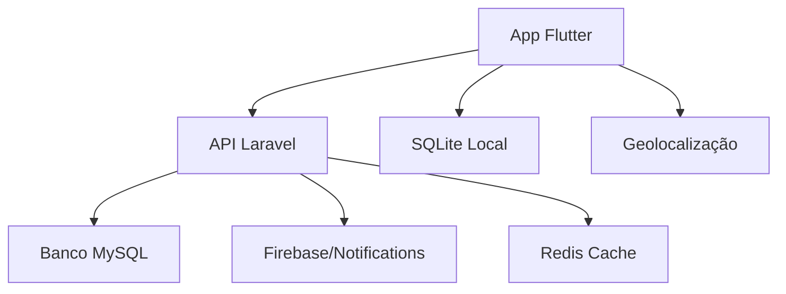

# VitaLink - Documentação Completa

## 📋 Índice
1. [Visão Geral](#visão-geral)
2. [Arquitetura do Sistema](#arquitetura-do-sistema)
3. [API Laravel - Backend](#api-laravel---backend)
4. [Aplicação Flutter - Mobile](#aplicação-flutter---mobile)
5. [Banco de Dados](#banco-de-dados)
6. [Configuração e Deploy](#configuração-e-deploy)
7. [Desenvolvimento](#desenvolvimento)

---

## 🌟 Visão Geral

**VitaLink** é uma plataforma inovadora que visa aumentar o número de doações de sangue no Brasil, conectando doadores a hemocentros de forma eficiente e moderna.

### Principais Funcionalidades
- 🩸 Cadastro de doadores com informações de tipo sanguíneo
- 🗺️ Localização de hemocentros próximos com mapas interativos
- 📱 Notificações sobre campanhas e necessidades urgentes
- 📚 Conteúdo educativo sobre doação de sangue
- 📊 Informações sobre estoques de sangue em tempo real
- 👤 Perfil do doador com histórico de doações

---

## 🏗️ Arquitetura do Sistema

### Estrutura Geral
```
vitalink/
├── api/           # Backend Laravel (API REST)
│   ├── app/       # Código da aplicação
│   ├── database/  # Migrações e seeds
│   ├── routes/    # Rotas da API
│   └── tests/     # Testes automatizados
│
└── mobile/        # Frontend Flutter
    ├── lib/       # Código da aplicação
    ├── assets/    # Recursos estáticos
    └── test/      # Testes do Flutter
```

### Fluxo de Dados


---

## 🔧 API Laravel - Backend

### Tecnologias Utilizadas
- **Framework**: Laravel 11
- **PHP**: 8.2+
- **Autenticação**: Laravel Sanctum
- **Banco de Dados**: MySQL 8.0+
- **Cache**: Redis
- **Notificações**: Firebase Cloud Messaging
- **Testes**: Pest PHP

### Estrutura da API

#### Endpoints Principais

**Autenticação**
- `POST /api/user/login` - Login do usuário
- `POST /api/user/register` - Registro de usuário
- `DELETE /api/user/logout` - Logout

**Usuários**
- `GET /api/user` - Dados do usuário atual
- `PUT /api/user/{id}` - Atualizar usuário
- `DELETE /api/user/{id}` - Excluir usuário

**Hemocentros**
- `GET /api/blood-center` - Listar hemocentros
- `POST /api/blood-center/register` - Cadastrar hemocentro
- `GET /api/blood-center/{id}` - Detalhes do hemocentro
- `PUT /api/blood-center/{id}` - Atualizar hemocentro
- `DELETE /api/blood-center/{id}` - Excluir hemocentro

**Notícias/Campanhas**
- `GET /api/news` - Listar notícias (público)
- `POST /api/news/register` - Criar notícia
- `GET /api/news/{id}` - Detalhes da notícia
- `PUT /api/news/{id}` - Atualizar notícia
- `DELETE /api/news/{id}` - Excluir notícia

#### Controllers Principais

**[`AuthController`](file:///c:/Users/Murilo%20Carazato/Documents/myh/BLOOD/vitalink/api/app/Http/Controllers/AuthController.php)**
- Gerencia autenticação customizada
- Validação de credenciais
- Geração de tokens Sanctum

**[`UserController`](file:///c:/Users/Murilo%20Carazato/Documents/myh/BLOOD/vitalink/api/app/Http/Controllers/UserController.php)**
- CRUD completo de usuários
- Validação de dados
- Controle de acesso por roles

**[`BloodCenterController`](file:///c:/Users/Murilo%20Carazato/Documents/myh/BLOOD/vitalink/api/app/Http/Controllers/BloodCenterController.php)**
- Gerenciamento de hemocentros
- Busca por localização
- Paginação de resultados

**[`NewsController`](file:///c:/Users/Murilo%20Carazato/Documents/myh/BLOOD/vitalink/api/app/Http/Controllers/NewsController.php)**
- Gerenciamento de notícias
- Integração com Firebase para notificações
- Categorização (campanhas/emergências)

---

## 📱 Aplicação Flutter - Mobile

### Tecnologias Utilizadas
- **Framework**: Flutter 3.10+
- **Dart**: 3.0+
- **Arquitetura**: Clean Architecture
- **Gerenciamento de Estado**: Provider
- **Banco Local**: SQLite
- **Mapas**: Geolocator
- **UI**: Material Design com tema customizado

### Estrutura da Aplicação

#### Arquitetura de Pastas
```
lib/
├── main.dart              # Ponto de entrada
├── src/
│   ├── app.dart          # Configuração principal
│   ├── pages/            # Telas da aplicação
│   ├── components/       # Componentes reutilizáveis
│   ├── localization/     # Internacionalização
│   └── settings/         # Configurações do app
└── services/
    ├── models/           # Modelos de dados
    ├── repositories/     # Camada de dados
    ├── stores/           # Gerenciamento de estado
    └── helpers/          # Utilitários
```

#### Principais Telas

**[`HomePage`](file:///c:/Users/Murilo%20Carazato/Documents/myh/BLOOD/vitalink/mobile/lib/src/pages/home.dart)**
- Dashboard principal do usuário
- Status de doação
- Ações rápidas
- Hemocentros próximos

**[`BloodCentersPage`](file:///c:/Users/Murilo%20Carazato/Documents/myh/BLOOD/vitalink/mobile/lib/src/pages/blood_centers.dart)**
- Lista paginada de hemocentros
- Busca e filtros
- Integração com mapas

**[`ProfilePage`](file:///c:/Users/Murilo%20Carazato/Documents/myh/BLOOD/vitalink/mobile/lib/src/pages/profile.dart)**
- Perfil do usuário
- Histórico médico
- Configurações pessoais

**[`GuidePage`](file:///c:/Users/Murilo%20Carazato/Documents/myh/BLOOD/vitalink/mobile/lib/src/pages/guide.dart)**
- FAQ sobre doação
- Requisitos e restrições
- Guia educativo

### Modelos de Dados

#### [`UserModel`](file:///c:/Users/Murilo%20Carazato/Documents/myh/BLOOD/vitalink/mobile/lib/services/models/user_model.dart)
```dart
class UserModel {
  final int id;
  final String name;
  final String birthDate;
  final String bloodType;
  final bool viewedTutorial;
  final bool hasTattoo;
  final bool hasMicropigmentation;
  final bool hasPermanentMakeup;
}
```

#### [`BloodCenterModel`](file:///c:/Users/Murilo%20Carazato/Documents/myh/BLOOD/vitalink/mobile/lib/services/models/blood_center_model.dart)
```dart
class BloodCenterModel {
  final int id;
  final String name;
  final String address;
  final String? phoneNumber;
  final String? email;
  final String? site;
  final double latitude;
  final double longitude;
}
```

### Gerenciamento de Estado

**[`UserStore`](file:///c:/Users/Murilo%20Carazato/Documents/myh/BLOOD/vitalink/mobile/lib/services/stores/user_store.dart)**
- Estado do usuário logado
- Dados de perfil
- Preferências

**[`BloodCenterStore`](file:///c:/Users/Murilo%20Carazato/Documents/myh/BLOOD/vitalink/mobile/lib/services/stores/blood_center_store.dart)**
- Lista de hemocentros
- Filtros e busca
- Paginação

**[`NearbyStore`](file:///c:/Users/Murilo%20Carazato/Documents/myh/BLOOD/vitalink/mobile/lib/services/stores/nearby_store.dart)**
- Hemocentros próximos
- Geolocalização
- Cálculo de distâncias

---

## 🗄️ Banco de Dados

### Estrutura das Tabelas

#### Tabela `users`
```sql
CREATE TABLE users (
    id BIGINT PRIMARY KEY AUTO_INCREMENT,
    name VARCHAR(255) NOT NULL,
    email VARCHAR(255) UNIQUE NOT NULL,
    password VARCHAR(255) NOT NULL,
    isadmin ENUM('superadmin', 'admin') NOT NULL,
    bloodcenter_id BIGINT NULLABLE,
    email_verified_at TIMESTAMP NULL,
    remember_token VARCHAR(100) NULL,
    created_at TIMESTAMP NULL,
    updated_at TIMESTAMP NULL
);
```

#### Tabela `bloodcenters`
```sql
CREATE TABLE bloodcenters (
    id BIGINT PRIMARY KEY AUTO_INCREMENT,
    name VARCHAR(255) NOT NULL,
    address VARCHAR(255) NOT NULL,
    phone_number VARCHAR(255) NOT NULL,
    email VARCHAR(255) UNIQUE NULL,
    site VARCHAR(255) NULL,
    latitude DOUBLE NOT NULL,
    longitude DOUBLE NOT NULL,
    created_at TIMESTAMP NULL,
    updated_at TIMESTAMP NULL
);
```

#### Tabela `news`
```sql
CREATE TABLE news (
    id BIGINT PRIMARY KEY AUTO_INCREMENT,
    title VARCHAR(255) NOT NULL,
    content TEXT NOT NULL,
    image LONGTEXT NULL,
    type ENUM('campaing', 'emergency') NOT NULL,
    user_id BIGINT NOT NULL,
    created_at TIMESTAMP NULL,
    updated_at TIMESTAMP NULL
);
```

### Relacionamentos
- **Users** → **BloodCenters** (belongsTo)
- **Users** → **News** (hasMany)
- **BloodCenters** → **Users** (hasMany)

### Banco Local (SQLite)
O app mobile utiliza SQLite para armazenamento offline:
- Dados do usuário
- Cache de hemocentros
- Histórico de doações

---

## ⚙️ Configuração e Deploy

### Requisitos do Sistema

#### Backend (API)
- PHP 8.2+
- Composer
- MySQL 8.0+
- Redis
- Extensões: OpenSSL, PDO, Mbstring, Tokenizer, XML, Ctype, JSON

#### Mobile
- Flutter 3.10+
- Dart 3.0+
- Android Studio / VS Code
- Android SDK (para Android)
- Xcode (para iOS)

### Configuração da API

1. **Instalação de Dependências**
```bash
cd api
composer install
```

2. **Configuração do Ambiente**
```bash
cp .env.example .env
# Editar .env com as configurações
php artisan key:generate
```

3. **Banco de Dados**
```bash
php artisan migrate --seed
```

4. **Servidor de Desenvolvimento**
```bash
php artisan serve
```

### Configuração do Mobile

1. **Dependências Flutter**
```bash
cd mobile
flutter pub get
```

2. **Configuração de APIs**
- Configurar chaves do Google Maps
- Configurar Firebase

3. **Execução**
```bash
flutter run
```

---

## 🚀 Desenvolvimento

### Comandos Úteis

#### API Laravel
```bash
# Testes
php artisan test
php artisan test --filter=TestName

# Linting
./vendor/bin/pint

# Banco de dados
php artisan migrate
php artisan db:seed

# Cache
php artisan cache:clear
php artisan config:clear
```

#### Flutter Mobile
```bash
# Testes
flutter test
flutter test test/widget_test.dart

# Análise
flutter analyze

# Build
flutter build apk
flutter build ios

# Limpeza
flutter clean
```

### Padrões de Código

#### Backend (PHP)
- **Padrão**: PSR-12
- **Arquitetura**: Domain-Driven Design
- **Validação**: Form Requests
- **Testes**: Pest PHP

#### Frontend (Dart)
- **Padrão**: Flutter/Dart Style Guide
- **Arquitetura**: Clean Architecture
- **Estado**: Provider Pattern
- **Testes**: Widget Tests

### Fluxo de Trabalho

1. **Feature Branch**: Criar branch para nova funcionalidade
2. **Desenvolvimento**: Implementar com testes
3. **Code Review**: Revisão de código
4. **Testing**: Executar suite de testes
5. **Deploy**: Merge para main e deploy

---

## 📊 Métricas e Monitoramento

### Logs
- **Laravel**: Logs em `storage/logs/`
- **Flutter**: Logs do sistema e crashes

### Performance
- **API**: Monitoramento de response time
- **Mobile**: Tracking de performance da UI

### Segurança
- **Autenticação**: Tokens Sanctum
- **Validação**: Sanitização de inputs
- **CORS**: Configuração para mobile

---

## 🔮 Roadmap Futuro

### Próximas Funcionalidades
- [ ] Notificações push em tempo real
- [ ] Gamificação para doadores
- [ ] Integração com outros apps de saúde
- [ ] Dashboard web para hemocentros
- [ ] API para parceiros externos

### Melhorias Técnicas
- [ ] Implementação de testes E2E
- [ ] CI/CD automatizado
- [ ] Monitoramento avançado
- [ ] Otimizações de performance
- [ ] Suporte a múltiplos idiomas

---

## 📞 Suporte

Para dúvidas técnicas ou sugestões, entre em contato através dos canais oficiais do projeto.

**© 2025 VitaLink - Todos os direitos reservados**
